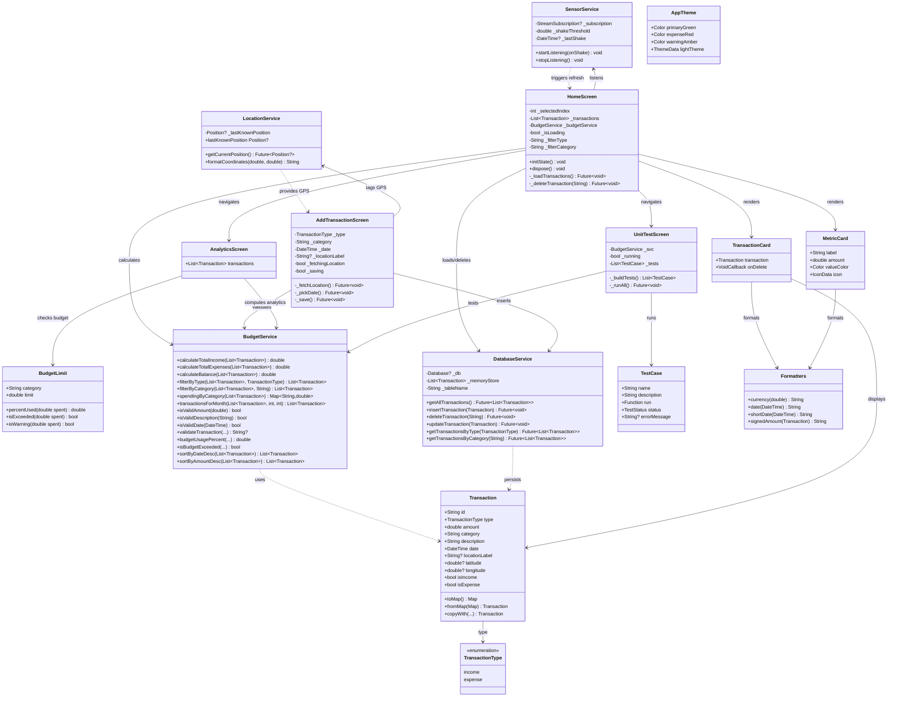
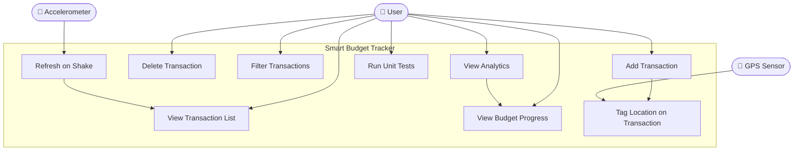
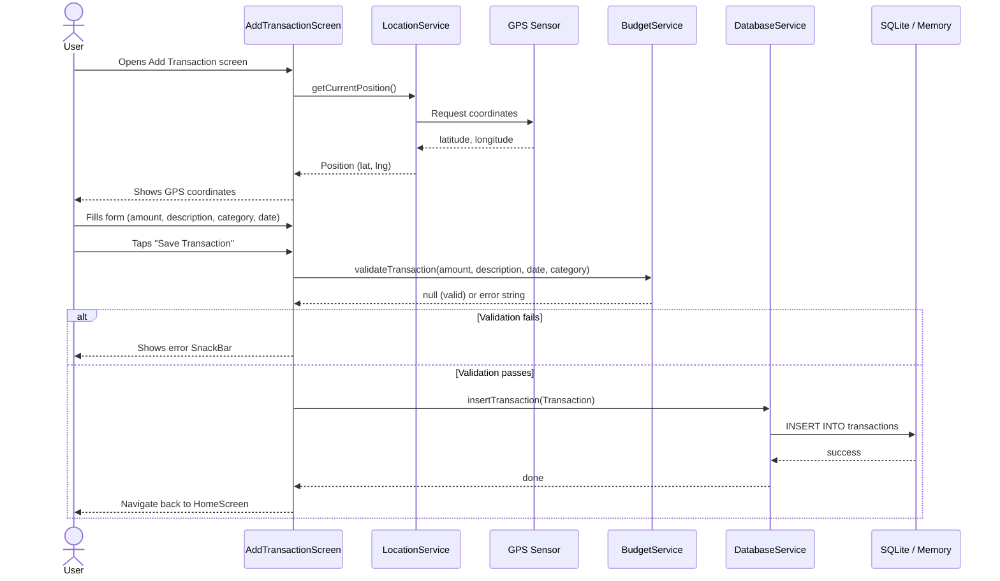
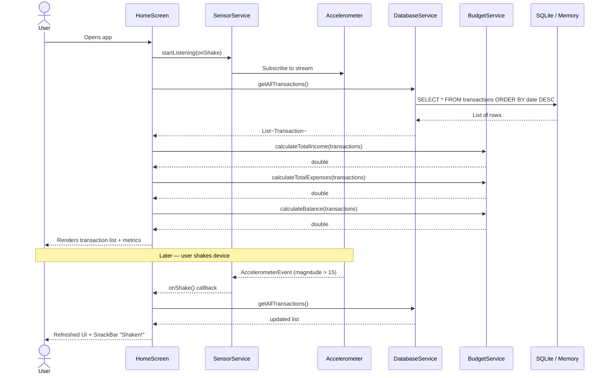
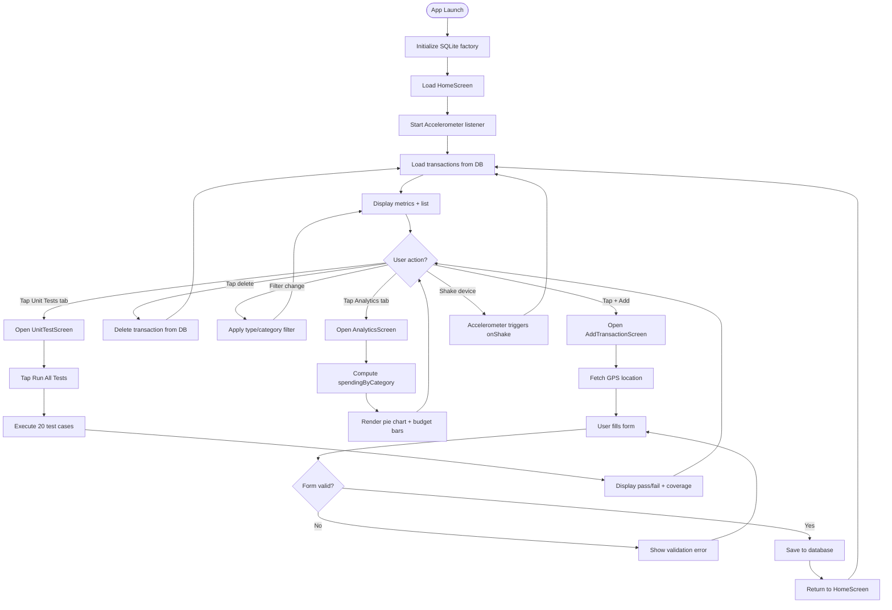
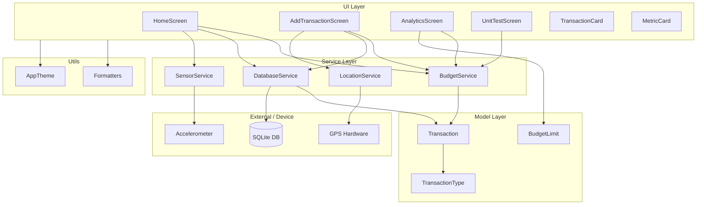
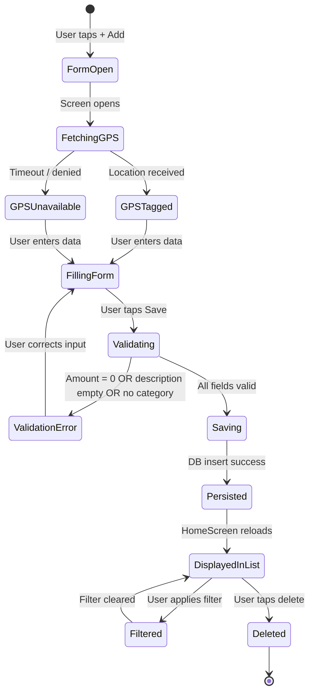
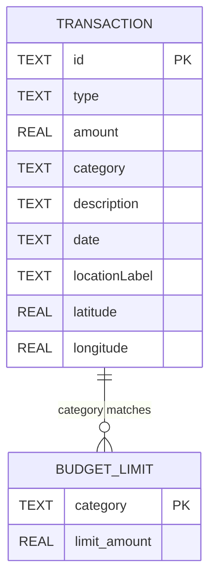

# Smart Budget Tracker

A cross-platform Flutter/Dart mobile application for personal finance management.  
Uses device sensors (GPS + Accelerometer) and includes a full automated unit test suite.

**Course project** — University of Yaoundé  
**Team roles:** Lead Developer + QA Developer  
**Tech stack:** Flutter 3.x · Dart 3.x · SQLite · GPS · Accelerometer

---

## Table of Contents

1. [Setup & Run](#setup--run)
2. [Project Structure](#project-structure)
3. [UML Diagrams](#uml-diagrams)
   - [1. Class Diagram](#1-class-diagram)
   - [2. Use Case Diagram](#2-use-case-diagram)
   - [3. Sequence Diagram — Add Transaction](#3-sequence-diagram--add-transaction)
   - [4. Sequence Diagram — Load Transactions](#4-sequence-diagram--load-transactions)
   - [5. Activity Diagram — App Flow](#5-activity-diagram--app-flow)
   - [6. Component Diagram](#6-component-diagram)
   - [7. State Diagram — Transaction Lifecycle](#7-state-diagram--transaction-lifecycle)
   - [8. Entity-Relationship Diagram](#8-entity-relationship-diagram)
4. [Sensors Used](#sensors-used)
5. [Unit Tests](#unit-tests)
6. [Course Requirements Checklist](#course-requirements-checklist)

---

## Setup & Run

```bash
# Install dependencies
flutter pub get

# Run on Android (recommended — full GPS + accelerometer support)
flutter run

# Run on Android emulator
flutter emulators --launch <emulator_id>
flutter run

# Run automated unit tests (QA developer deliverable)
flutter test
flutter test --reporter expanded
```

---

## Project Structure

```
lib/
├── main.dart                        # App entry point + DB factory init
├── models/
│   ├── transaction.dart             # Transaction data model + enum
│   └── budget_limit.dart            # Budget limit model
├── services/
│   ├── budget_service.dart          # Core business logic (lead dev)
│   ├── database_service.dart        # SQLite / in-memory persistence
│   ├── location_service.dart        # GPS sensor (geolocator)
│   └── sensor_service.dart          # Accelerometer sensor (sensors_plus)
├── screens/
│   ├── home_screen.dart             # Transactions list + metrics
│   ├── add_transaction_screen.dart  # Add transaction form
│   ├── analytics_screen.dart        # Charts + budget progress
│   └── unit_test_screen.dart        # In-app test runner
├── widgets/
│   ├── transaction_card.dart        # Transaction list item
│   └── metric_card.dart             # Summary metric card
└── utils/
    ├── app_theme.dart               # Colors, typography, theme
    └── formatters.dart              # Currency, date, category helpers
test/
└── budget_service_test.dart         # 20 automated unit tests
```

---

## UML Diagrams

### 1. Class Diagram

Shows all classes, their attributes, methods, and relationships.



---

### 2. Use Case Diagram

Shows what each actor (User, GPS Sensor, Accelerometer) can do in the system.



---

### 3. Sequence Diagram — Add Transaction

Shows the step-by-step interaction between all components when a user saves a new transaction.



---

### 4. Sequence Diagram — Load Transactions

Shows how the home screen loads and displays data, including the shake-to-refresh sensor flow.



---

### 5. Activity Diagram — App Flow

Shows the full flow of user actions from app launch to completing any operation.



---

### 6. Component Diagram

Shows how the main layers of the application depend on each other.



---

### 7. State Diagram — Transaction Lifecycle

Shows all the states a transaction goes through from creation to deletion.



---

### 8. Entity-Relationship Diagram

Shows the data structure stored in the SQLite database.



---

## Sensors Used

| Sensor | Package | Usage |
|---|---|---|
| **GPS / Geolocation** | `geolocator ^11.0.0` | Tags each transaction with device coordinates at time of creation |
| **Accelerometer** | `sensors_plus ^5.0.1` | Detects shake gesture (magnitude > 15) to trigger transaction list refresh |

Permission required in `AndroidManifest.xml`:
```xml
<uses-permission android:name="android.permission.ACCESS_FINE_LOCATION"/>
<uses-permission android:name="android.permission.ACCESS_COARSE_LOCATION"/>
```

---

## Unit Tests

File: `test/budget_service_test.dart` — **20 test cases**

| Group | Tests | Scenarios covered |
|---|---|---|
| `calculateTotalIncome` | 3 | Correct sum, empty list, no income entries |
| `calculateTotalExpenses` | 2 | Correct sum, empty list |
| `calculateBalance` | 3 | Income − expenses, empty list, negative balance |
| `filterByType` | 3 | Expenses only, income only, no matches |
| `filterByCategory` | 3 | Match, case-insensitive, not found |
| `isValidAmount` | 3 | Positive, zero, negative |
| `isValidDescription` | 2 | Non-empty, empty / whitespace-only |
| `validateTransaction` | 4 | Valid → null, zero amount, empty description, empty category |
| `spendingByCategory` | 2 | Groups correctly, excludes income |
| `isBudgetExceeded` | 3 | Over limit, under limit, no spending |
| `sortByDateDesc` | 1 | Most recent first |
| `sortByAmountDesc` | 1 | Highest first |
| `transactionsForMonth` | 2 | Correct month, wrong month → empty |

```bash
# Run all tests
flutter test

# Run with detailed output
flutter test --reporter expanded
```

---

## Course Requirements Checklist

- [x] Team of 2: lead developer + QA developer
- [x] Device sensors: GPS (location tagging) + Accelerometer (shake to refresh)
- [x] Automated unit tests: 20 test cases in `test/budget_service_test.dart`
- [x] Test scenarios cover valid input, empty input, and edge cases
- [x] Test report shows pass count, fail count, and coverage percentage
- [x] In-app test runner (Unit Tests tab) for live demonstration

# Smart-budget-tracker